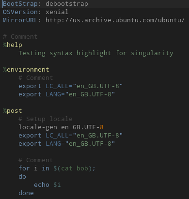
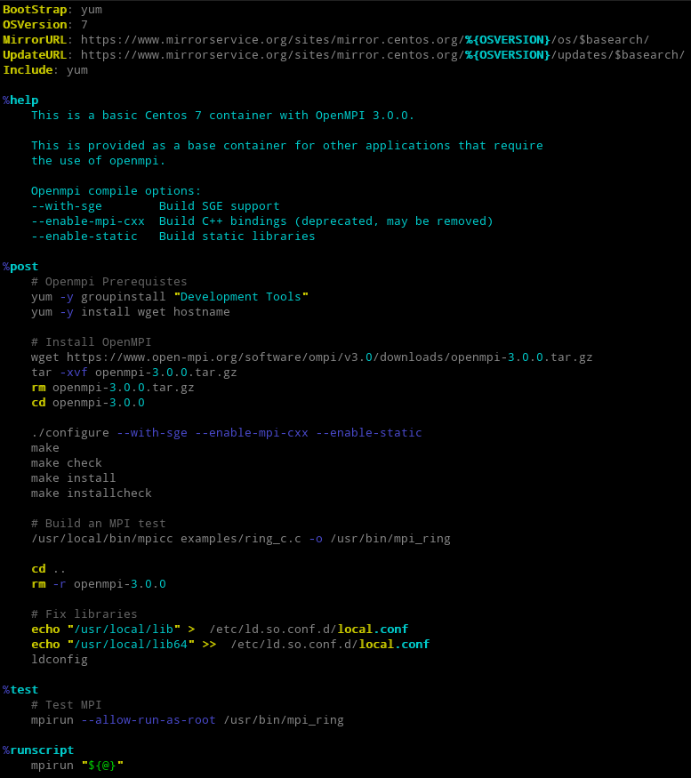

# Vim Syntax Highlighting for Singularity/Apptainer files

*Based on https://github.com/singularityhub/singularity.lang, including only the vim
part (thus making it easier to install).*





## Installation

### Vundle

Add the following to your vimrc:

```vim
Plugin 'luator/singularity.vim'
```

### neovim's vim.pack

```lua
vim.pack.add({ 'https://github.com/luator/singularity.vim' })
```
